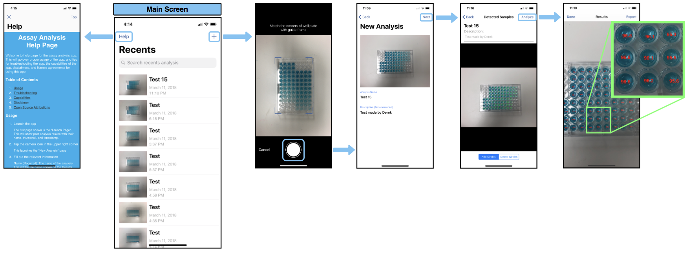

# User Manual


**Welcome to Optical Assay application!**

This will go over proper usage of the app, and tips for troubleshooting the app, the capabilities of the app, disclaimers, and license agreements for using this app.

Table of Contents
1. [Installation](#install)
2. [Usage](#usage)
3. [Troubleshooting](#troubleshooting)
4. [Capabilities](#capabilities)
5. [Disclaimer](#Disclaimer)
6. [Open Source Attributions](#attributions)

## Installation
For storage and uploading reason, we did not install the necessary pods for the project.

If you do not have CocoaPods install, please follow the following guide from CocoaPods:

         [CocoaPods: Getting Started](https://guides.cocoapods.org/using/getting-started.html)

After download the project, please open the **Podfile** with any text editor and uncomment the following pods:

```
- 'JGProgressHUD'
- 'Alamofire', '~> 4.0'
- 'SwiftyDropbox', '~> 4.2'
- 'OpenCV2'
- 'TextFieldEffects'
```

Then, install the pods via CocoaPods:
```
pod install
```

## Usage



**1. Launch the app.** The first page shown is the "Recent Page". This will show past analysis results with their name, thumbnail, and timestamp.

**2. Tap the “+” icon in the upper right corner.** This launches the "New Analysis" page

**3. Fill out the relevant information.** Analysis Name (Required): The name of the analysis. This will be the name shown on the Results Page Description (Not required): A short description that describes the analysis

**4. Tap the "Choose Image" icon.** To capture a new image to analyze, tap "Camera". The screen should show what the camera sees, with a rectangular frame overlaid on the view.

         Tips to take a good shot for the analysis:
         - Center the plate inside of the rectangular frame.
         - Align the sides of the rectangle with the plate.
         - Keep the phone as level as possible.
         - Avoid direct light and glare.
         - Use an even consistent background for the image, even outside of the rectangular frame.

**5.Tap the circular icon on the screen to capture the image when it is ready.** The app will capture the image and return you back to the "New Analysis" page.

**6. Hit "Next" in the upper right corner** The image will be processed to detect test tube wells. If not all of the filled test tubes have been detected, tap on that it to circle it. If there are extra circles (empty test tubes, random junk) detected, tap "Delete Circle" and tap on the extra circles to remove them.

      - Note: For extra precision, zoom into the image by pinching and tap the center of test tube

**7. Tap "Analyze" when the image is ready to be processed.** The relative concentrations of the test tubes will be overlain over the test tubes. Zoom in to view them if the text is too small.

**8. If you are satisfied, hit "Export" to save the analysis to the launch page**

      - Tap “Mail” to email the results as a .csv file
      - Tap “Dropbox” to upload the results to dropbox as a .csv

**9. Then, hit "Done" to return to the Launch Page**

      - To view past results, tap on the thumbnail of the result you wish to view.
      - To delete any past result, swipe right on the thumbnail and tap "Delete".
      - To perform another analysis, repeat start from the beginning of this list.

## Troubleshooting
To improve the accuracy of the analysis, make sure to follow these steps:

-  Center the plate inside of the rectangular frame.
-  Align the sides of the rectangle with the plate.
-  Keep the phone as level as possible.
-  Avoid direct light and glare.
-  Use an even consistent background for the image, even outside of the rectangular frame.

## Capabilities
-  Well Detection Rate: 98%
-  Minimum hue value: 188 degree at 34% Saturation and 65% Brightness (HSB)
-  Max Error Rate: 44%
-  Average Error Rate: 12%

      ***Note:***
      Error rate is defined as the percent difference between the sample and the actual value.
      The application is expected to be used in an indoor scenario where the room is evenly lit.
      The application have been tested with blue food coloring dye only.

## Disclaimer
The information provided by this app is not intended or implied to be a substitute for professional medical advice, diagnosis or treatment. This app is not intended or implied to to be a replacement for a proper microplate reader, and is only to be used for estimating concentrations of assays. The makers of this app, the Cal Poly Optical Assay Capstone Group and the California Polytechnic State University will not be held liable for any damages caused by this app.

## License Agreement
### @ Copyright 2017-2018, Cal Poly Optical Assay Capstone Group. All rights reserved.

By downloading, copying, installing or using the software you agree to this license. If you do not agree to this license, do not download, install, copy or use the software.

The source code is confidential and only available to authorized individuals with the permission of the copyright holders. If you encounter this source code and do not have permission, please contact the copyright holders and delete this source code.

This software is provided by the copyright holders and contributors "as is" and any express or implied warranties, including, but not limited to, the implied warranties of merchantability and fitness for a particular purpose are disclaimed. In no event shall copyright holders or contributors be liable for any direct, indirect, incidental, special, exemplary, or consequential damages (including, but not limited to, procurement of substitute goods or services; loss of use, data, or profits; or business interruption) however caused and on any theory of liability, whether in contract, strict liability, or tort (including negligence or otherwise) arising in any way out of the use of this software, even if advised of the possibility of such damage.


## License Agreement For Open Source Computer Vision Library

(3-clause BSD License)

Redistribution and use in source and binary forms, with or without modification, are permitted provided that the following conditions are met:

- Redistributions of source code must retain the above copyright notice, this list of conditions and the following disclaimer.

- Redistributions in binary form must reproduce the above copyright notice, this list of conditions and the following disclaimer in the documentation and/or other materials provided with the distribution.

- Neither the names of the copyright holders nor the names of the contributors may be used to endorse or promote products derived from this software without specific prior written permission.

This software is provided by the copyright holders and contributors “as is” and any express or implied warranties, including, but not limited to, the implied warranties of merchantability and fitness for a particular purpose are disclaimed. In no event shall copyright holders or contributors be liable for any direct, indirect, incidental, special, exemplary, or consequential damages (including, but not limited to, procurement of substitute goods or services; loss of use, data, or profits; or business interruption) however caused and on any theory of liability, whether in contract, strict liability, or tort (including negligence or otherwise) arising in any way out of the use of this software, even if advised of the possibility of such damage.

© Copyright 2018, OpenCV team
